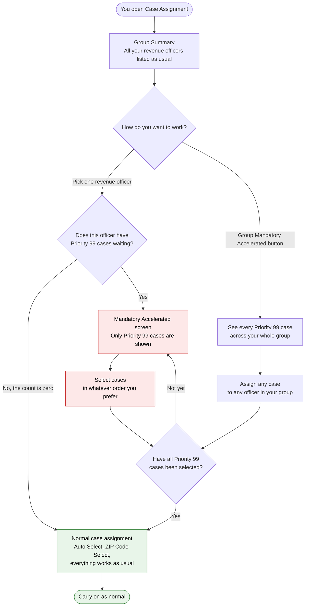
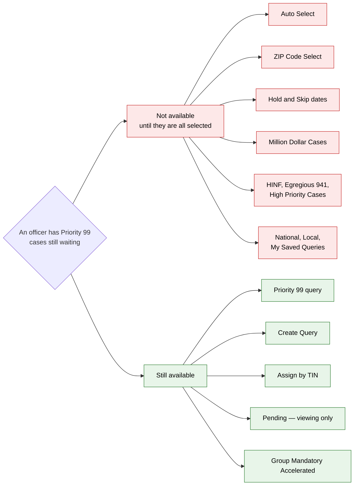
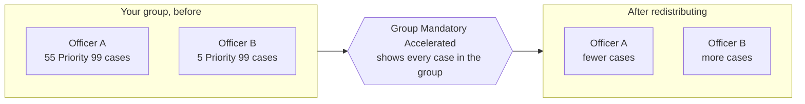
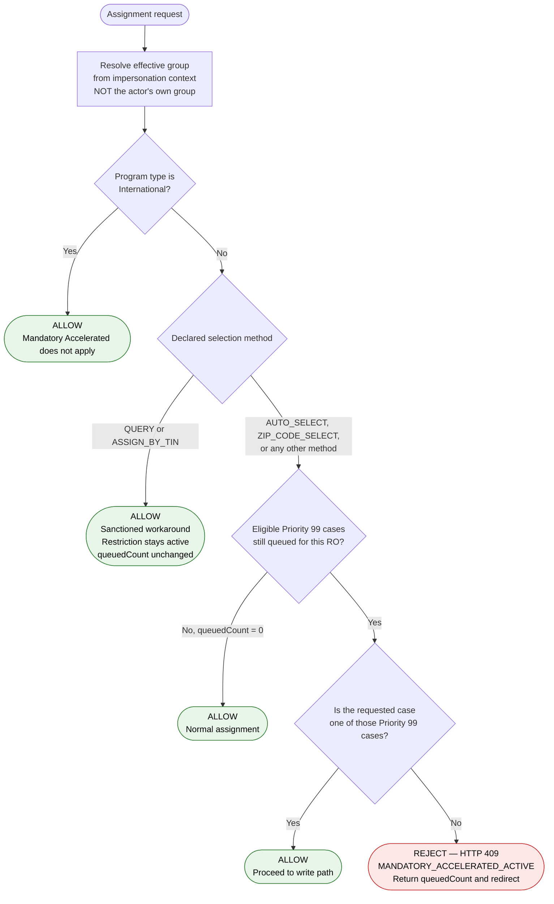
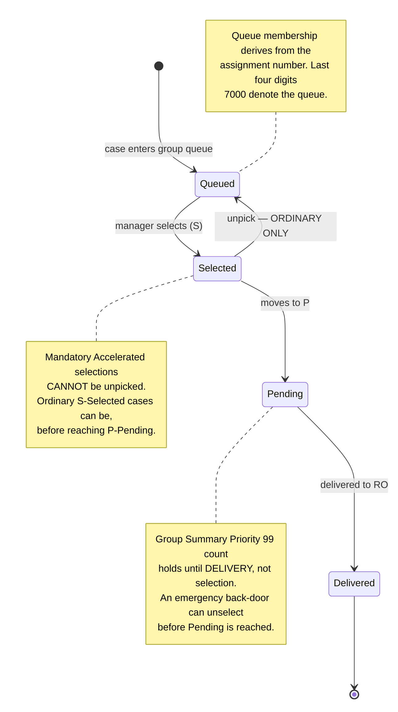
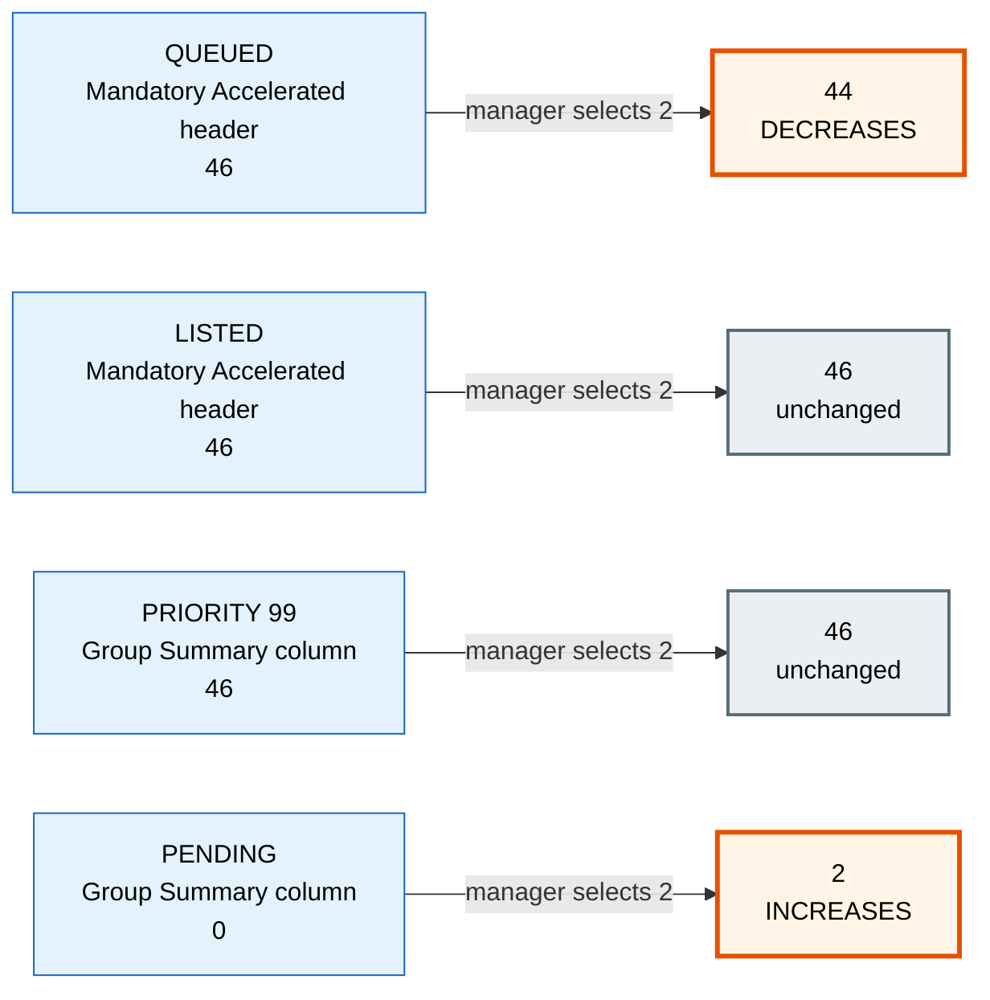
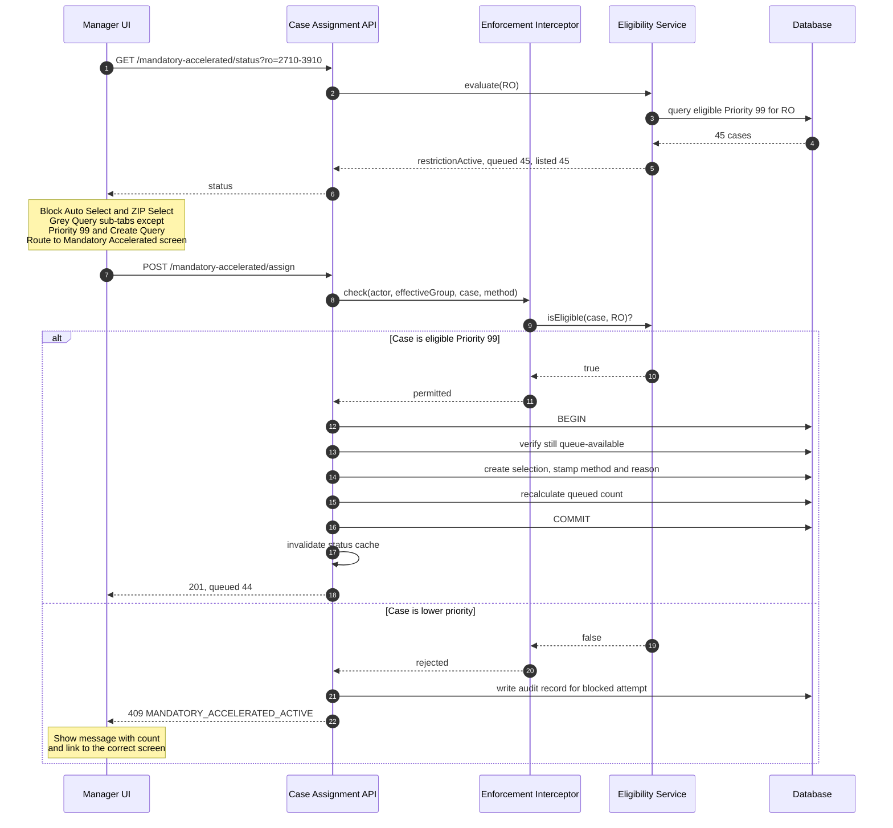
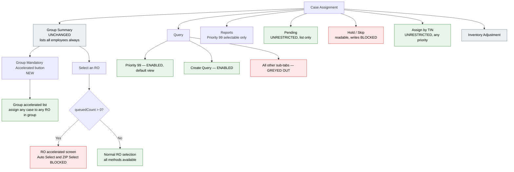

# Mandatory Accelerated Case Assignment — Diagrams

Mermaid source. Renders in Confluence, JIRA (with the Mermaid app), GitHub, GitLab, and mermaid.live.

**Part 1** is written for Group Managers and other end users — plain language, no system terms.
**Part 2** is for developers and testers.

---

# PART 1 — For End Users

## 1.1 What happens when you assign cases

**The rule in one sentence:** if an officer has Priority 99 cases, you must select all of them before you can assign anything else to that officer.

**Three things worth knowing:**

- You choose the order. There is no requirement to take 99a before 99b.
- Once you select a Priority 99 case, you cannot undo it. Ordinary selections can still be undone before they reach Pending.
- An officer with no Priority 99 cases is completely unaffected. Nothing changes for them.

## 1.2 What you can and cannot do while Priority 99 cases are waiting

**If you have an emergency,** Create Query and Assign by TIN both still work and let you pick any priority. Using them does not switch the restriction off for anything else.

## 1.3 Balancing work across your group

Cases are lined up against officers by ZIP code, but that is a suggestion rather than a rule. From the group screen you can assign any case to any officer in your group, including one who has no Priority 99 cases of their own.

---

# PART 2 — For Developers and Testers

## 2.1 Enforcement decision flow

The logic the interceptor implements. Every assignment request passes through this.

**Notes for implementation**

- The impersonation step is first for a reason. A National Analyst operating as "Viewing as: Group NNNNNN" must inherit that group's restrictions. Reading the actor's own group is the most likely bypass in the build.
- Selection method is a declared request parameter, not inferred from the endpoint. Inference means a new endpoint silently defaults to permitted.
- There is no branch testing whether the case is 99a versus 99b. Order within the accelerated set is unrestricted.
- This check runs in the service layer, so every entry point inherits it.

## 2.2 Case state lifecycle

## 2.3 How the four counts move

The likeliest source of defects. Two fall, two hold.

The restriction lifts when **Queued** reaches zero. Binding release logic to Listed produces a counter that never moves and an unlock that never fires. Binding the Group Summary column to queue-available inventory produces 44 where the business expects 46.

## 2.4 Assignment sequence

The re-check inside the transaction is deliberate. The status call at the start is advisory — two managers can both pass it and race for the last case.

## 2.5 Screen access map

What each surface does while the restriction is active. Useful for building test coverage.

**Open item:** Reports scope is not confirmed. Sarah has not reviewed the modern Reports implementation, so the restriction shown above is the stated intent rather than verified behaviour.

---

## Traceability

| Diagram | Covers | Test cases |
|---|---|---|
| 2.1 Enforcement decision | BE-C | TC-301 to TC-303, TC-501 to TC-503, TC-701 to TC-707 |
| 2.2 State lifecycle | BE-D | TC-404 to TC-406 |
| 2.3 Count behaviour | BE-A, BE-B, FE-D | TC-208, TC-604, TC-605 |
| 2.4 Assignment sequence | BE-C, BE-D | TC-401, TC-408, TC-409 |
| 2.5 Screen access map | BE-C, FE-B | TC-505 to TC-509 |
