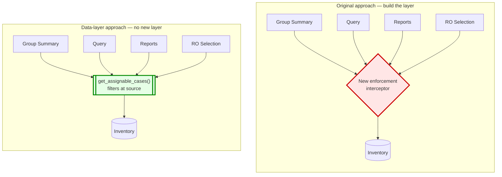
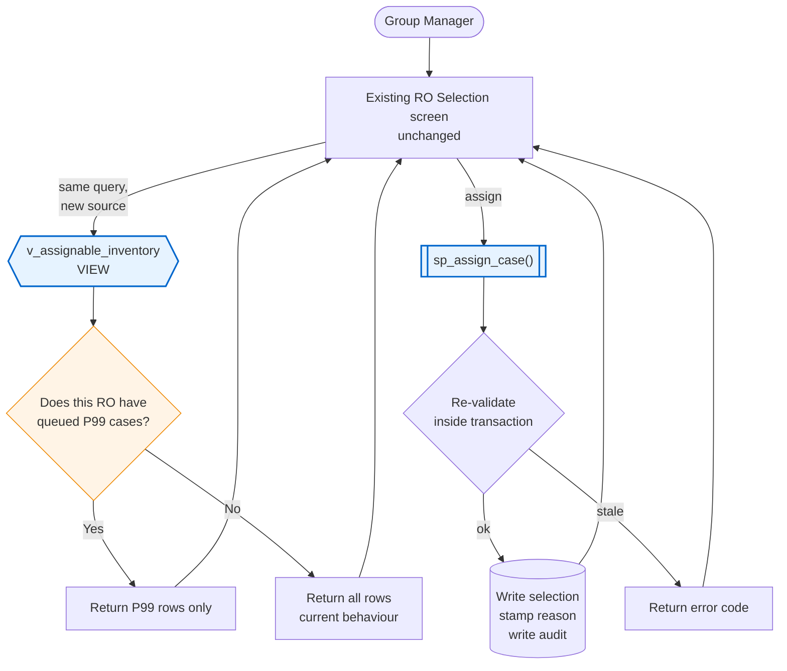
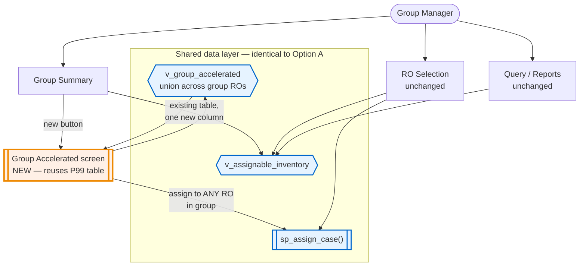

# Scrum Notes — Mandatory Accelerated Design Spike

**Reporting period:** design and legacy code review

## Done

**Legacy code review.** Went through the Legacy ENTITY Mandatory Accelerated implementation and the F2 screen behaviour. The finding that matters: legacy doesn't enforce this with an application-layer gate. The restriction lives in how inventory is *served* — the case list a manager receives is already filtered before it reaches the screen. Legacy's UI has no restriction logic in it at all. It renders what it's given.

That's a materially different shape from the interceptor approach we specced, and it's cheaper.

**Design spike.** Produced two minimal-footprint options, both pushing enforcement into the data layer as stored procedures and views, with UI changes measured in fields rather than screens. Mermaid diagrams for both, ready to walk through.

## Key finding

The original backlog assumed a new cross-screen enforcement layer, sized at 200–266 hours. That estimate was driven by Islam's observation that modern has no gateway between Group Summary, Query and Reports. Correct observation, but the conclusion doesn't follow. If the filtering happens in the query that feeds each surface, no gateway is needed — each surface independently gets correct data because they all call the same procedure.

Both options below are in the 60–110 hour range. The saving is real, and it comes from not building the layer.

## Trade-off to be explicit about

Enforcement in the data layer means the rules are expressed in SQL and PL/SQL rather than in Java. That's harder to unit test, harder to code-review, and puts business logic where fewer developers on the team read fluently. It's the right call for schedule and footprint. It's the wrong call if this module is expected to grow. Worth a decision rather than a default.

## Blockers

Unchanged from yesterday and now more urgent — Sarah is out until 24 September. Both designs need the grade criteria comparison rule and the recalculation cadence answered before build.

## Next

Walk through both options, pick one, size it properly.

---

# The two designs

## What both share

The insight from legacy: **make the queue itself lie.** If a manager's inventory query returns only Priority 99 cases when accelerated inventory exists, there is nothing to enforce. The manager can't select what isn't there, and every screen inherits the behaviour for free because every screen is asking the same question of the same source.

The red box is roughly 120 hours of new architecture. The green one is a function.

---

## Option A — Filtered View

**One database view and one stored procedure. Zero new UI screens.**

Every existing inventory query switches from reading the base table to reading a view. The view returns only accelerated cases when accelerated inventory exists for that RO, and everything otherwise. Assignment goes through a procedure that re-validates and stamps the reason code.

**UI change: one field.** The count in the page header, read from a column the view already returns. Nothing else. No new screens, no disabled states, no routing logic, no status polling.

**Why the restriction "lifts automatically" for free.** There's no state to clear. The view re-evaluates on every read. Last case selected, next query returns everything. Rule 7 satisfied without writing code for it.

**Where it falls short.** The group-level screen — the F2 equivalent, where a manager sees every accelerated case across the group and rebalances between officers — has no existing surface to attach to. Option A can't deliver it without new UI. That's a genuine parity regression against legacy, not a cosmetic one, and Sarah's stated purpose for the screen was exactly that rebalancing.

Roughly **60–80 hours**.

---

## Option B — Filtered View + Group Screen

Option A, plus one new page reusing the existing Priority 99 query table component with a different data source.

The orange box is the only new UI in the whole design. Everything else is a data source swap.

Roughly **90–110 hours**.

---

## Comparison

| | Original spec | Option A | Option B |
|---|---|---|---|
| New enforcement layer | Yes | No | No |
| New UI screens | 2 | 0 | 1 |
| Existing screens touched | 6+ | 1 field | 2 fields + 1 button |
| Group rebalancing (F2 parity) | Yes | **No** | Yes |
| Estimate | 200–266h | 60–80h | 90–110h |

---

## Three things to raise when you present this

**Direct API calls bypass a view.** If modern's endpoints are only ever reached by modern's UI, that's acceptable. If they're consumable directly, a filtered view is a data-shaping decision, not a security control — someone who queries the base table sees everything. The stored procedure re-validates on write, so nothing incorrect can be *committed*, but the read side is open. Worth confirming who can reach the endpoints before committing to this approach.

**Business logic in PL/SQL is a real cost, not a free lunch.** Fewer people on the team can review it, it doesn't unit test the way Java does, and it won't show up in application-level static analysis. Genuinely the right trade for a September-pressured launch blocker. Genuinely the wrong one if this module grows over the next two years. Make it a recorded decision.

**Option A drops a feature.** Not a screen — a capability. A manager holding one officer at 55 accelerated cases and another at 5 has no way to rebalance. Sarah raised that example unprompted, which suggests it happens. If the group screen has to go, that should be a decision someone makes out loud rather than something the estimate quietly absorbs.

I'd recommend Option B. The delta over A is 30 hours for the one thing A can't do, and it still comes in at under half the original number.

The legacy review finding is worth verifying independently before anyone commits to it — ask Samuel and Diane whether the filtering genuinely sits in the inventory query in legacy, or whether there's application-layer enforcement I didn't find. The whole saving rests on that.
